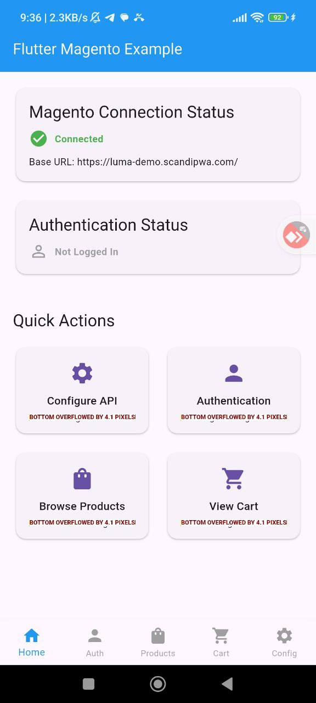
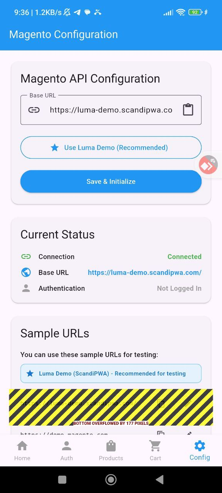

# 🚀 Flutter Magento Plugin 2.0

Унифицированная Flutter библиотека для интеграции с Magento e-commerce платформой. Версия 2.0 устраняет дублирование кода между приложениями и предоставляет 200+ функций для создания современных мобильных коммерческих приложений.

## 📱 Скриншоты

<div align="center">
  
  
  
</div>

<div align="center">
  
  
  
</div>

## ✨ Новые возможности в версии 2.0

### 🎯 **Унифицированная архитектура**
- **Устранение дублирования**: Один API для всех приложений
- **Модульная структура**: Используйте только нужные компоненты
- **Типобезопасность**: Строгая типизация с Freezed моделями
- **Консистентность**: Одинаковый подход во всех приложениях

### 🔐 **Продвинутая аутентификация**
- JWT токены с автоматическим обновлением
- Безопасное хранение с FlutterSecureStorage
- Поддержка "Запомнить меня"
- Автоматическая валидация токенов
- Обработка истечения сессии

### 🌐 **Унифицированный сетевой слой**
- Dio + HTTP клиент с автоматическими повторными попытками
- Мониторинг подключения к интернету
- Автоматическая обработка ошибок
- Логирование запросов в debug режиме
- Кэширование ответов

### 🌍 **Система локализации**
- **45+ языков** из коробки
- Автоматическое определение системной локали
- Поддержка множественного числа
- RTL поддержка для арабского и иврита
- Кастомные переводы

### 📱 **Офлайн режим**
- Автоматическое кэширование данных
- Очередь операций для офлайн режима
- SQLite + Hive для быстрого доступа
- Автоматическая синхронизация при восстановлении сети
- Настраиваемые стратегии кэширования

### 🎨 **Управление состоянием**
- Provider + ChangeNotifier паттерн
- Готовые провайдеры для всех сервисов
- Реактивные обновления UI
- Централизованное управление состоянием

### 🛍️ **Расширенная e-commerce функциональность**
- Полная интеграция с Magento REST API
- GraphQL поддержка для сложных запросов
- Корзина с поддержкой гостевых пользователей
- Wishlist с множественными списками
- Продвинутый поиск и фильтрация

## 🚀 Начало работы

### Установка

Добавьте зависимость в ваш `pubspec.yaml`:

```yaml
dependencies:
  flutter_magento: ^2.0.0
```

### Быстрый старт

```dart
import 'package:flutter_magento/flutter_magento.dart';
import 'package:provider/provider.dart';

void main() {
  runApp(
    MultiProvider(
      providers: [
        ChangeNotifierProvider(create: (_) => MagentoProvider()),
        ChangeNotifierProxyProvider<MagentoProvider, AuthProvider>(
          create: (context) => AuthProvider(context.read<MagentoProvider>().auth),
          update: (context, magentoProvider, previous) => 
              previous ?? AuthProvider(magentoProvider.auth),
        ),
      ],
      child: MyApp(),
    ),
  );
}
```

## 📱 Поддержка платформ

- ✅ Android
- ✅ iOS
- ✅ Web
- ✅ Windows
- ✅ macOS
- ✅ Linux

## 🌍 Локализация

Этот README доступен на нескольких языках:
- [English](README.md)
- [Русский](README_ru.md) (Текущий)
- [ไทย](README_th.md)
- [中文](README_cn.md)

## 🤝 Вклад в проект

1. Сделайте форк репозитория
2. Создайте ветку для функции
3. Внесите изменения
4. Добавьте тесты
5. Отправьте pull request

## 📄 Лицензия

Этот проект лицензирован под лицензией NativeMindNONC - см. файл [LICENSE](LICENSE) для деталей.

## 🆘 Поддержка

- 📧 Email: support@nativemind.net
- 🐛 Проблемы: [GitHub Issues](https://github.com/nativemind/flutter_magento/issues)
- 📚 Документация: [Wiki](https://github.com/nativemind/flutter_magento/wiki)
- 💬 Сообщество: [Discord](https://discord.gg/nativemind)

---

**Сделано с ❤️ командой NativeMind**