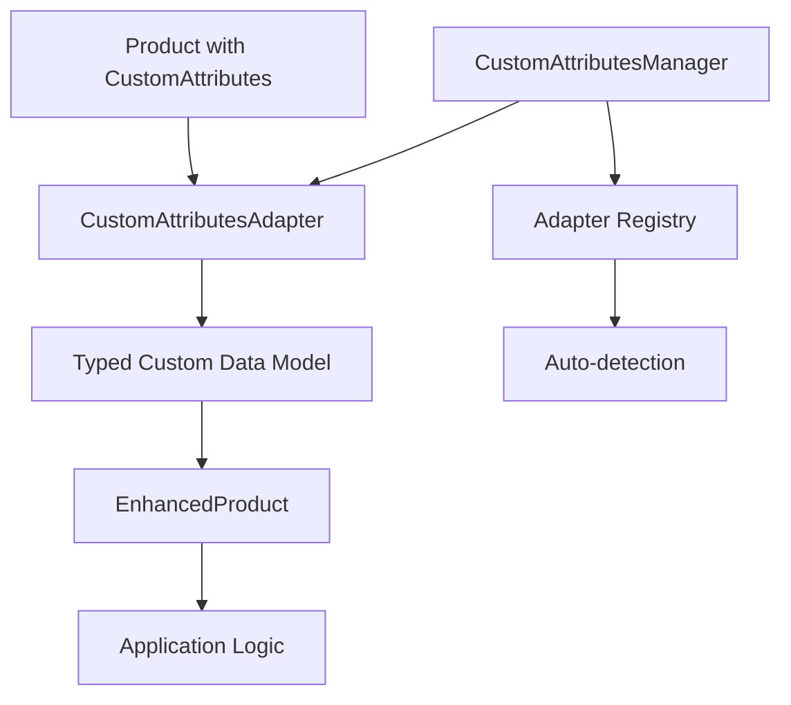

# Universal Custom Attributes System

## Обзор

Универсальная система кастомных атрибутов для Flutter Magento позволяет каждому приложению работать со своими уникальными кастомными атрибутами продуктов без изменений в библиотеке или на стороне бэкенда Magento.

## Архитектура

### Основные компоненты

1. **CustomAttributesAdapter<T>** - Базовый интерфейс для создания адаптеров
2. **CustomAttributesManager** - Менеджер для регистрации и управления адаптерами  
3. **EnhancedProduct<T>** - Расширенная модель продукта с типизированными кастомными атрибутами
4. **EnhancedProductApi** - API для работы с продуктами через адаптеры
5. **ValidationResult** - Результат валидации кастомных атрибутов

### Принципы работы



## Создание кастомного адаптера

### Шаг 1: Определите модель данных

```dart
@freezed
class YourCustomAttributes with _$YourCustomAttributes {
  const factory YourCustomAttributes({
    String? customField1,
    int? customField2,
    double? customField3,
    List<String>? customList,
    Map<String, dynamic>? customMap,
  }) = _YourCustomAttributes;

  factory YourCustomAttributes.fromJson(Map<String, dynamic> json) =>
      _$YourCustomAttributesFromJson(json);
}
```

### Шаг 2: Создайте адаптер

```dart
class YourCustomAdapter extends CustomAttributesAdapter<YourCustomAttributes> {
  @override
  List<String> get supportedAttributeCodes => [
    'custom_field_1',
    'custom_field_2', 
    'custom_field_3',
    'custom_list',
    'custom_map',
  ];

  @override
  YourCustomAttributes fromCustomAttributes(List<CustomAttribute> attributes) {
    final attrMap = {for (var attr in attributes) attr.attributeCode: attr.value};
    
    return YourCustomAttributes(
      customField1: attrMap['custom_field_1'],
      customField2: int.tryParse(attrMap['custom_field_2'] ?? ''),
      customField3: double.tryParse(attrMap['custom_field_3'] ?? ''),
      customList: attrMap['custom_list']?.split(','),
      customMap: _parseJsonMap(attrMap['custom_map']),
    );
  }

  @override
  List<CustomAttribute> toCustomAttributes(YourCustomAttributes model) {
    final attributes = <CustomAttribute>[];
    
    if (model.customField1 != null) {
      attributes.add(CustomAttribute(
        attributeCode: 'custom_field_1', 
        value: model.customField1!,
      ));
    }
    
    if (model.customField2 != null) {
      attributes.add(CustomAttribute(
        attributeCode: 'custom_field_2',
        value: model.customField2!.toString(),
      ));
    }
    
    // ... остальные поля
    
    return attributes;
  }

  @override
  ValidationResult validate(YourCustomAttributes model) {
    final errors = <String>[];
    
    if (model.customField2 != null && model.customField2! < 0) {
      errors.add('Custom field 2 must be non-negative');
    }
    
    return ValidationResult(isValid: errors.isEmpty, errors: errors);
  }

  @override
  U? getAttributeValue<U>(List<CustomAttribute> attributes, String code) {
    final attr = attributes.firstWhere(
      (attr) => attr.attributeCode == code,
      orElse: () => const CustomAttribute(attributeCode: '', value: ''),
    );
    
    if (attr.value.isEmpty) return null;
    
    // Приведение типов
    if (U == String) return attr.value as U?;
    if (U == int) return int.tryParse(attr.value) as U?;
    if (U == double) return double.tryParse(attr.value) as U?;
    if (U == bool) return (attr.value.toLowerCase() == 'true') as U?;
    
    return null;
  }

  @override
  Map<String, dynamic> buildSearchFilters(YourCustomAttributes model) {
    final filters = <String, dynamic>{};
    
    if (model.customField1 != null) {
      filters['custom_field_1'] = model.customField1;
    }
    
    if (model.customField2 != null) {
      filters['custom_field_2'] = model.customField2;
    }
    
    return filters;
  }

  Map<String, dynamic>? _parseJsonMap(String? jsonString) {
    if (jsonString == null) return null;
    try {
      return json.decode(jsonString) as Map<String, dynamic>;
    } catch (e) {
      return null;
    }
  }
}
```

## Использование

### Инициализация с кастомными адаптерами

```dart
void main() async {
  // Создаем адаптеры
  final yourAdapter = YourCustomAdapter();
  final anotherAdapter = AnotherCustomAdapter();
  
  // Инициализируем FlutterMagento
  final magento = FlutterMagento();
  await magento.initialize(
    baseUrl: 'https://your-magento-store.com',
    customAdapters: [yourAdapter, anotherAdapter],
  );
  
  // Или регистрируем адаптеры вручную
  CustomAttributesManager.instance.registerAdapter('your_adapter', yourAdapter);
}
```

### Работа с продуктами

```dart
// Получение продуктов с кастомными атрибутами
final products = await magento.enhancedProducts.getEnhancedProducts<YourCustomAttributes>(
  adapterId: 'your_adapter',
  page: 1,
  pageSize: 20,
  customAttributeFilters: {
    'custom_field_1': 'some_value',
    'custom_field_2': 42,
  },
);

// Работа с результатами
for (final product in products.items) {
  print('Product: ${product.baseProduct.name}');
  
  if (product.customData != null) {
    final customData = product.customData!;
    print('Custom Field 1: ${customData.customField1}');
    print('Custom Field 2: ${customData.customField2}');
    print('Custom Field 3: ${customData.customField3}');
  }
  
  // Прямой доступ к кастомным атрибутам
  final rawValue = product.getCustomAttribute('some_attribute');
  print('Raw attribute value: $rawValue');
}
```

### Поиск по кастомным атрибутам

```dart
// Поиск продуктов по кастомным атрибутам
final searchResults = await magento.enhancedProducts.searchByCustomAttributes<YourCustomAttributes>(
  customAttributeFilters: {
    'custom_field_1': 'search_value',
    'custom_field_2': {'gteq': '10'}, // больше или равно 10
    'custom_field_3': {'range': {'from': '1.0', 'to': '100.0'}}, // диапазон
  },
  adapterId: 'your_adapter',
  sortBy: 'custom_field_2',
  sortOrder: 'DESC',
);
```

### Автоматическое определение адаптера

```dart
// Система автоматически определит подходящий адаптер
final product = await magento.enhancedProducts.getEnhancedProduct<YourCustomAttributes>('product-sku');

if (product.customData != null) {
  print('Detected adapter: ${product.adapterId}');
  print('Custom data: ${product.customData}');
}
```

## Примеры адаптеров

### AR/3D адаптер (Samskara)

```dart
@freezed
class ARAttributes with _$ARAttributes {
  const factory ARAttributes({
    String? modelPath,
    String? soundPath,
    String? arReferenceImage,
    double? arWidth,
    double? arHeight,
    String? artistName,
    String? artistBio,
    int? viewCount,
    int? interactionCount,
    double? averageRating,
    String? orientation,
    double? modelScale,
    List<String>? tags,
  }) = _ARAttributes;

  factory ARAttributes.fromJson(Map<String, dynamic> json) =>
      _$ARAttributesFromJson(json);
}

class SamskaraARAdapter extends CustomAttributesAdapter<ARAttributes> {
  @override
  List<String> get supportedAttributeCodes => [
    'model_path', 'sound_path', 'ar_reference_image',
    'ar_width', 'ar_height', 'artist_name', 'artist_bio',
    'view_count', 'interaction_count', 'average_rating',
    'orientation', 'model_scale', 'tags',
  ];

  // ... реализация методов
}
```

### Fashion адаптер

```dart
@freezed
class FashionAttributes with _$FashionAttributes {
  const factory FashionAttributes({
    String? color,
    String? size,
    String? material,
    String? brand,
    String? season,
    List<String>? availableSizes,
    double? discount,
    String? careInstructions,
    String? fabricComposition,
    String? countryOfOrigin,
  }) = _FashionAttributes;

  factory FashionAttributes.fromJson(Map<String, dynamic> json) =>
      _$FashionAttributesFromJson(json);
}

class FashionAdapter extends CustomAttributesAdapter<FashionAttributes> {
  @override
  List<String> get supportedAttributeCodes => [
    'color', 'size', 'material', 'brand', 'season',
    'available_sizes', 'discount', 'care_instructions',
    'fabric_composition', 'country_of_origin',
  ];

  // ... реализация методов
}
```

## Валидация

```dart
// Валидация кастомных атрибутов
final adapter = CustomAttributesManager.instance.getAdapter<YourCustomAttributes>('your_adapter');
final validationResult = adapter?.validate(customData);

if (validationResult != null && !validationResult.isValid) {
  print('Validation errors:');
  for (final error in validationResult.errors) {
    print('- $error');
  }
}
```

## Фильтрация и сортировка

### Поддерживаемые операторы фильтрации

- `eq` - равно
- `neq` - не равно  
- `like` - содержит (для строк)
- `nlike` - не содержит
- `in` - входит в список
- `nin` - не входит в список
- `gt` - больше
- `gte` / `gteq` - больше или равно
- `lt` - меньше
- `lte` / `lteq` - меньше или равно
- `range` - диапазон значений

### Примеры фильтров

```dart
final filters = {
  // Точное совпадение
  'color': 'red',
  
  // Поиск по подстроке
  'brand': {'like': '%nike%'},
  
  // Список значений
  'size': {'in': ['S', 'M', 'L']},
  
  // Числовые диапазоны
  'price': {'range': {'from': '10.00', 'to': '100.00'}},
  
  // Больше/меньше
  'discount': {'gt': '20'},
  'rating': {'gte': '4.0'},
};
```

## Производительность

### Кэширование адаптеров

```dart
// Адаптеры автоматически кэшируются в CustomAttributesManager
final adapter = CustomAttributesManager.instance.getAdapter<YourCustomAttributes>('your_adapter');

// Повторное обращение будет использовать кэш
final sameAdapter = CustomAttributesManager.instance.getAdapter<YourCustomAttributes>('your_adapter');
```

### Ленивая загрузка

```dart
// EnhancedProduct использует ленивую загрузку для преобразования атрибутов
final product = EnhancedProduct<YourCustomAttributes>.fromProduct(baseProduct);

// Кастомные данные преобразуются только при первом обращении
final customData = product.customData; // Здесь происходит преобразование
```

## Отладка

### Логирование

```dart
// Включить отладочные логи
CustomAttributesManager.instance.enableDebugLogging = true;

// Логи будут показывать:
// - Регистрацию адаптеров
// - Автоматическое определение адаптеров  
// - Ошибки валидации
// - Производительность преобразований
```

### Диагностика

```dart
// Получить информацию о зарегистрированных адаптерах
final adapters = CustomAttributesManager.instance.registeredAdapters;
print('Registered adapters: ${adapters.keys}');

// Проверить поддерживаемые атрибуты
for (final entry in adapters.entries) {
  print('${entry.key}: ${entry.value.supportedAttributeCodes}');
}
```

## Лучшие практики

### 1. Именование атрибутов

- Используйте snake_case для кодов атрибутов
- Добавляйте префиксы для группировки: `ar_width`, `ar_height`
- Используйте описательные имена: `artist_name` вместо `name`

### 2. Типы данных

- Всегда обрабатывайте null значения
- Используйте tryParse для числовых значений
- Валидируйте входные данные

### 3. Производительность

- Регистрируйте адаптеры один раз при инициализации
- Используйте кэширование для часто используемых преобразований
- Избегайте тяжелых операций в методах адаптера

### 4. Тестирование

```dart
void main() {
  group('YourCustomAdapter', () {
    late YourCustomAdapter adapter;
    
    setUp(() {
      adapter = YourCustomAdapter();
    });
    
    test('should convert custom attributes correctly', () {
      final attributes = [
        CustomAttribute(attributeCode: 'custom_field_1', value: 'test'),
        CustomAttribute(attributeCode: 'custom_field_2', value: '42'),
      ];
      
      final result = adapter.fromCustomAttributes(attributes);
      
      expect(result.customField1, equals('test'));
      expect(result.customField2, equals(42));
    });
    
    test('should validate correctly', () {
      final model = YourCustomAttributes(customField2: -1);
      final result = adapter.validate(model);
      
      expect(result.isValid, isFalse);
      expect(result.errors, contains('Custom field 2 must be non-negative'));
    });
  });
}
```

## Миграция

### Из существующих решений

Если у вас уже есть кастомная логика для обработки атрибутов:

1. Создайте модель данных с помощью `@freezed`
2. Перенесите логику преобразования в адаптер
3. Замените прямые обращения к `customAttributes` на `EnhancedProduct`
4. Добавьте валидацию и типизацию

### Обратная совместимость

Система полностью совместима с существующим API:

```dart
// Старый способ - продолжает работать
final products = await magento.products.getProducts();
final customAttr = products.items.first.customAttributes?.first.value;

// Новый способ - с типизацией
final enhancedProducts = await magento.enhancedProducts.getEnhancedProducts<YourCustomAttributes>();
final typedValue = enhancedProducts.items.first.customData?.customField1;
```

## Заключение

Универсальная система кастомных атрибутов обеспечивает:

- ✅ Типобезопасность кастомных атрибутов
- ✅ Универсальность для любых типов приложений  
- ✅ Простоту использования и интеграции
- ✅ Высокую производительность
- ✅ Расширяемость и гибкость
- ✅ Полную совместимость с Magento API
- ✅ Автоматическое определение адаптеров
- ✅ Встроенную валидацию

Это решение позволяет сотням различных приложений работать со своими уникальными кастомными атрибутами без изменений в библиотеке или бэкенде.
